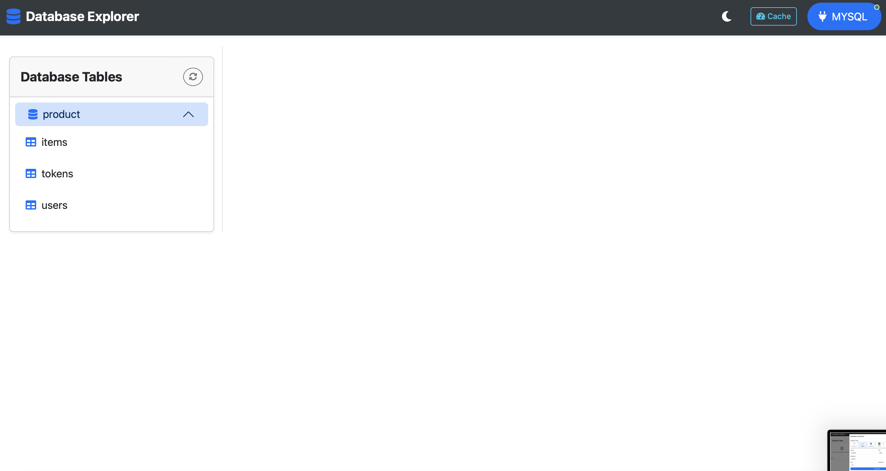

#  Database Explorer & Management Tool


A powerful database management tool built with FastAPI and Redis caching, designed for efficiently working with multiple database engines and exploring data through an intuitive web interface.

## ✨ Features

- **🗄️ Multi-Database Support**
  - Connect to MS SQL Server, MySQL, PostgreSQL, SQLite, and more
  - View and manage tables across different database servers
  - Execute custom SQL queries with syntax highlighting

- **📊 Table Management**
  - Browse, search, and filter database tables
  - Create, read, update, and delete records
  - View detailed table schemas and relationships
  - Export query results in multiple formats

- **⚡ Performance Optimization**
  - Redis-powered caching layer for faster queries
  - Efficient pagination for large datasets
  - Connection pooling for database connections

- **🔒 Security & Access**
  - Secure credential management
  - Session-based authentication
  - Role-based access control
  - Encrypted database connections

## 📸 Screenshots

Here are some screenshots of the application:

<div align="center">
  
  
</div>

<div align="center">
  
  
</div>

*Note: Replace the `src` attributes with the actual paths to your screenshot images.*

## 🧑‍🏫 User Guide

### 1. Connecting to a Database

1.  Click the "Database" button in the top right corner.
    
    *Replace with an image of the connection button.*

2.  Select the database type and enter the connection details.
    
    *Replace with an image of the connection modal.*

3.  Click "Connect".

### 2. Exploring Tables

1.  Once connected, the list of tables will appear on the left.
    
    *Replace with an image of the tables list.*

2.  Click a table name to view its data.

### 3. Viewing and Editing Data

1.  The table data will be displayed in a grid.
    
    *Replace with an image of the table data view.*

2.  Double-click a cell to edit its value.

3.  Click the "Add" button to add a new record.

### 4. Monitoring Cache

1.  Click the "Cache" button in the top right corner.
    
    *Replace with an image of the cache button.*

2.  View the cache status and breakdown.
    
    *Replace with an image of the cache monitor.*

## 💻 Tech Stack

- **Backend**: FastAPI
- **Caching**: Redis
- **Database Drivers**: MSSQL, MySQL, PostgreSQL connectors
- **Frontend**: Bootstrap UI, JavaScript
- **Containerization**: Docker & Docker Compose

## ⚙️ Installation

### Option 1: Local Development

1. **Clone the repository:**
   ```bash
   git clone https://github.com/yourusername/DbTest1.git
   cd DbTest1
   ```

2. **Set up virtual environment:**
   ```bash
   python -m venv myEnv
   source myEnv/bin/activate  # On Windows: myEnv\Scripts\activate
   ```

3. **Install dependencies:**
   ```bash
   pip install -r requirements.txt
   ```

4. **Configure environment:**
   ```bash
   cp .env1.example .env1
   # Edit .env1 with your database credentials
   ```

5. **Start Redis:**
   ```bash
   redis-server
   ```

6. **Run the application:**
   ```bash
   uvicorn app.main:app --reload --port 8000
   ```

7. **Access the app:**
   Open `http://localhost:8000` in your web browser.

### Option 2: Docker Deployment

1. **Clone the repository:**
   ```bash
   git clone https://github.com/yourusername/DbTest1.git
   cd DbTest1
   ```

2. **Configure environment:**
   ```bash
   cp .env1.example .env1
   # Edit .env1 with your database credentials
   ```

3. **Start with Docker Compose:**
   ```bash
   docker-compose up -d
   ```

4. **Access the application:**
   Open `http://localhost:8000` in your web browser.

## 🌐 Configuration

Edit the `.env1` file with your specific configuration:

```
# Database Connection Parameters
DB_SERVER="your-db-server"
DB_DATABASE="your-database"
DB_USER="your-username"
DB_PASSWORD="your-password"
DB_PORT=1433

# Redis Configuration
REDIS_HOST=localhost  # Use 'redis' for Docker
REDIS_PORT=6379
REDIS_DB=0
REDIS_PASSWORD=
REDIS_TTL=3600  # Cache TTL in seconds

# Application Settings
DEBUG=True
LOG_LEVEL=INFO
```

## 📁 Project Structure

```
DbTest1/
├── app/
│   ├── main.py              # Application entry point
│   ├── db/                  # Database connections
│   │   ├── database.py      # Connection management
│   │   ├── redis_caches.py  # Redis caching
│   │   └── dbDriver/        # Database connectors
│   ├── model/               # Data models
│   ├── routers/             # API routes
│   ├── static/              # Static assets
│   └── templates/           # HTML templates
├── docker-compose.yml       # Docker configuration
├── Dockerfile               # Docker image definition
├── requirements.txt         # Dependencies
└── .env1                    # Environment variables
```

## 🔍 API Endpoints

| Endpoint | Method | Description |
|----------|--------|-------------|
| `/api/tables` | GET | List all tables |
| `/api/tables/{table_name}` | GET | Get table details |
| `/api/tables/{table_name}/count` | GET | Get record count |
| `/api/tables/{table_name}/records` | GET | Get paginated records |
| `/api/tables/{table_name}/schema` | GET | Get table schema |
| `/api/tables/{table_name}/records` | POST | Create record |
| `/api/tables/{table_name}/records/{id}` | GET | Get record by ID |
| `/api/tables/{table_name}/records/{id}` | PUT | Update record |
| `/api/tables/{table_name}/records/{id}` | DELETE | Delete record |
| `/docs` | GET | API documentation |

## 🐳 Docker Commands

```bash
# Start services
docker-compose up -d

# View logs
docker-compose logs -f

# Rebuild after changes
docker-compose up -d --build

# Stop services
docker-compose down
```

## 🌐 External Access (Optional)

To expose your local instance using localtunnel:

```bash
# Install localtunnel
npm install -g localtunnel

# Start tunnel
lt --port 8000 --subdomain dbtest1 --password "YourSecurePassword"
```

## 📦 Requirements

```
aiofiles==23.2.1
aioodbc==0.5.0
annotated-types==0.7.0
anyio==4.9.0
blinker==1.9.0
click==8.2.0
dnspython==2.7.0
fastapi==0.115.0
greenlet==3.2.2
h11==0.16.0
httptools==0.6.4
idna==3.10
Jinja2==3.1.4
MarkupSafe==3.0.2
mysql-connector-python==9.3.0
pydantic==2.11.4
pydantic-settings==2.9.1
pydantic_core==2.33.2
pymssql==2.2.6
pyodbc==5.2.0
python-dotenv==1.1.0
python-multipart==0.0.20
PyYAML==6.0.2
redis==5.0.8
sniffio==1.3.1
SQLAlchemy==2.0.41
starlette==0.38.6
typing==3.7.4.3
typing-inspection==0.4.0
typing_extensions==4.13.2
uvicorn==0.30.6
uvloop==0.21.0
watchfiles==1.0.5
websockets==15.0.1

```

## 🛠️ Troubleshooting

**Database Connection Issues**
- Check credentials in `.env1` file
- Verify network connectivity to database server
- Ensure proper database drivers are installed

**Redis Connection Issues**
- Check if Redis server is running
- Verify Redis connection parameters
- Test connection with `redis-cli ping`

**Docker Issues**
- Check if ports are already in use
- Verify Docker daemon is running
- Check container logs with `docker-compose logs`

## 🤝 Contributing

1. Fork the repository
2. Create your feature branch (`git checkout -b feature/AmazingFeature`)
3. Commit your changes (`git commit -m 'Add some AmazingFeature'`)
4. Push to the branch (`git push origin feature/AmazingFeature`)
5. Open a Pull Request

## 📄 License

This project is licensed under the MIT License - see the LICENSE file for details.

## 📞 Support

For support, please open an issue in the GitHub repository or contact the development team.
